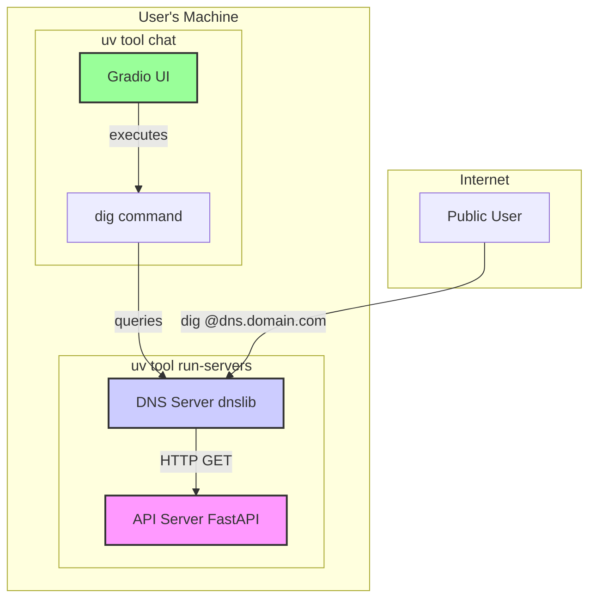

# LLM Radio 📻

[](https://www.python.org/downloads/)
[](https://github.com/astral-sh/uv)
[](https://github.com/psf/black)
[](https://github.com/astral-sh/ruff)
[](https://pytest.org/)
[](#)
[](https://conventionalcommits.org)
[](https://gitmoji.dev)

Serve Large Language Model (LLM) responses over the DNS protocol. This project provides a modular and extensible framework for interacting with LLMs through unconventional protocols.

## 🚀 Features

*   Query LLMs via standard DNS `TXT` record lookups.
*   Modular two-part design (DNS Server + API Server).
*   Fully type-annotated, linted, and tested codebase.
*   Extensible architecture for adding new protocols.

## 🏛️ Architecture

The system consists of two core servers and a Gradio-based client. The servers can be run locally for development or deployed to a public server.


<details>
<summary>Mermaid Diagram Source</summary>



</details>

## 🏗️ Project Plan

This project is being built incrementally. Here is the development roadmap:

- [x] **Phase 1: Core Functionality**
- [ ] **Phase 2: Usability & Features**
  - [ ] **Step 7: Enhance Servers for Public & Unified Startup**
  - [ ] **Step 8: Implement Gradio Chat Client**
  - [ ] **Step 9: Configure `uv` tool for Gradio client**
  - [ ] **Step 10: Finalize and Document New Features**

## 🛠️ Setup & Installation

1.  **Clone the repository:**
    ```bash
    git clone <repository-url>
    cd llm-radio
    ```

2.  **Create a virtual environment and install dependencies:**
    This project uses `uv` for package management.
    ```bash
    uv venv --clear
    uv sync --all-extras
    ```

3.  **Set up pre-commit hooks:**
    ```bash
    uv run pre-commit install
    ```

4.  **Configure Environment Variables:**
    Create a `.env` file in the project root and add your LLM API key:
    ```bash
    LLM_MODEL="your-model"
    LLM_API_KEY="your-secret-key-here"
    LLM_API_BASE="your-model-base-url"
    ```

## Usage

1.  **Run the Servers:**
    Use the `run-servers` tool to start both the API and DNS servers concurrently.
    ```bash
    uv run run-servers
    ```

2.  **Query via the Chat Interface:**
    Launch the Gradio client with the `chat` tool.
    ```bash
    uv run chat
    ```

3.  **Query via the Command Line:**
    ```bash
    dig @localhost -p 1053 "your question here" TXT +short
    ```

## 🧪 Development & Testing

To run the test suite and generate a coverage report:

```bash
uv run pytest --cov=src/llm_radio --cov-report=term-missing --cov-fail-under=90
```
